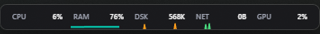

# StatsWidget



A lightweight, always-on-top Windows taskbar overlay that shows real-time CPU, RAM, Disk I/O, Network, and GPU usage with sparkline graphs.

Click-through (doesn't block mouse clicks) and stays visible above all windows.

## Quick Start (for friends)

**Option 1 — Pre-built EXE (easiest):**
Just grab `release/StatsWidget.exe` — runs directly, no install needed.
(Runs on Windows 10 1803+ / Windows 11 — WebView2 is preinstalled.)

**Option 2 — Build from source:**

```bash
git clone <repo-url>
cd stats-widget-win
npm run package
```

Output: `release/StatsWidget.exe`

Prerequisites: [Node.js 18+](https://nodejs.org), [Rust](https://rustup.rs)

## Tech Stack

| Layer | Technology |
|-------|-----------|
| Desktop framework | [Tauri v2](https://v2.tauri.app/) |
| Backend | Rust (sysinfo + Windows PDH) |
| Frontend | TypeScript + HTML + CSS |
| Bundler | Vite |

## NPM Scripts

| Command | Description |
|---------|-------------|
| `npm run tauri dev` | Dev mode with hot-reload |
| `npm run package` | Build production EXE into `release/` |
| `npm run build` | Frontend only (`tsc && vite build`) |
| `npm run preview` | Preview frontend in browser |

## How It Works

- Finds the system tray clock via Win32 APIs and sits to its left
- Click-through window (mouse events pass through to the taskbar)
- Checks visibility and maintains topmost Z-order every 500ms
- Polls CPU/RAM/Network via `sysinfo`, Disk/GPU via Windows PDH every 1 second
- Text values and sparklines rendered on Canvas in a transparent Tauri webview

## Project Structure

```
src/                  # Frontend (TypeScript, CSS)
src-tauri/src/        # Backend (Rust)
src-tauri/tauri.conf.json  # Window config (370×36, transparent, always-on-top)
build.ps1             # Windows build script
```
